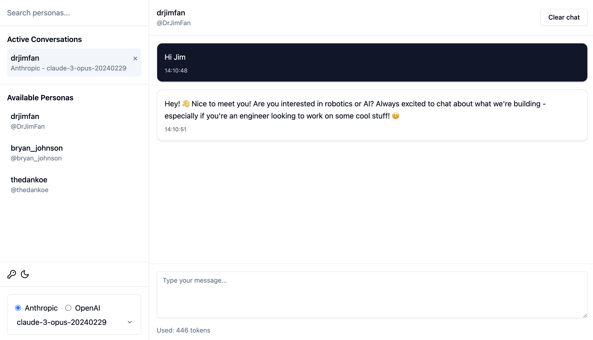
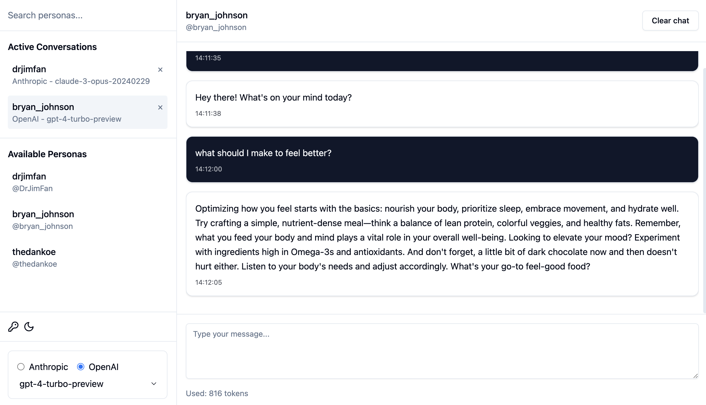
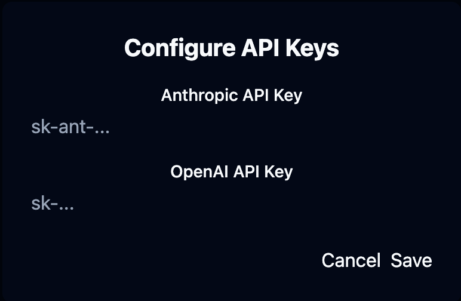

# Aigent-Twitter-X: Bringing Twitter Personalities to Life with AI

## Introduction to the Aigent Community

The Aigent-Twitter-X project is a pioneering initiative within the Aigent Community, a revolutionary open-source movement dedicated to democratizing AI agent development. The Aigent Community's mission is to create and share fully transparent, customizable AI agents that leverage various APIs and SDKs, making advanced AI applications accessible to developers worldwide.

## Project Evolution and Data Pipeline

A crucial component of this project was developed by forking and customizing the [twitter-scraper-finetune repository](https://github.com/elizaOS/twitter-scraper-finetune), which we've enhanced and maintained in our [Aigent Community version](https://github.com/aigent-community/twitter-scraper-finetune). This customized fork provides a sophisticated pipeline for:

1. **Data Collection**: Automated scraping of Twitter profiles
2. **Character Profile Generation**: Creating detailed personality analyses
3. **AI Training Dataset Creation**: Structured data for model fine-tuning
4. **Aigent Profile Generation**: AI-ready profiles with behavioral patterns

The integration of this pipeline allows our project to:
- Generate accurate personality models
- Maintain authenticity in AI responses
- Create comprehensive character profiles
- Enable continuous learning and improvement

## Chat using Anthropic's Claude AI



## Chat using OpenAI's GPT-4



## Technical Architecture

### Frontend Stack
- **React + TypeScript**: Providing a robust, type-safe foundation
- **Vite**: Enabling lightning-fast development and optimized builds
- **Tailwind CSS**: Delivering a modern, responsive design system
- **Local Storage**: Ensuring privacy-focused data persistence

### AI Integration
- **Anthropic's Claude AI**: Powering natural language understanding and generation
- **OpenAI Integration**: Support for GPT models including GPT-4 and GPT-3.5
- **Extensible AI Provider System**: Ready for integration with additional AI models
- **Real-time Token Usage Tracking**: Monitoring and optimizing AI interactions

### Privacy and Security
- **Client-side Processing**: All conversations remain on the user's device
- **Secure API Key Management**: Browser-based encryption for API credentials
- **No Server Dependencies**: Pure frontend architecture for maximum privacy



## Key Features

### 🎭 Dynamic Persona System
- Customizable persona database
- Personality-specific conversation handling
- Direct links to original Twitter profiles
- Contextual awareness in responses

### 💬 Modern Chat Interface
- Real-time message processing
- Conversation persistence
- Timestamp tracking
- Token usage monitoring
- Dark/Light mode support

### 🔍 User Experience
- Intuitive persona selection
- Searchable persona directory
- Responsive design
- Session management

## Developer Experience

The project emphasizes developer-friendly features:
```bash
# Quick Start
bun install
bun run dev
```

### Extensibility
- Add new personas via `personas-db.json`
- Implement additional AI providers
- Customize UI components
- Enhance conversation handling

## Part of Something Bigger

As a member of the Aigent Community, this project demonstrates:
1. **Open Source Philosophy**: Complete transparency in AI agent implementation
2. **API Integration**: Blueprint for connecting various AI services
3. **Community-Driven Development**: Encouraging contributions and improvements
4. **Educational Value**: Learning resource for AI application development

## Data Pipeline Architecture

### 1. Twitter Data Collection
```bash
bun run twitter -- username
```
- Raw tweets stored in `pipeline/{username}/{date}/raw/tweets.json`
- URLs extracted to `pipeline/{username}/{date}/raw/urls.txt`
- Media files saved in dedicated directories

### 2. Character Generation
```bash
bun run character -- username YYYY-MM-DD
```
- Behavioral analysis
- Communication pattern recognition
- Topic extraction
- Personality profiling

### 3. Aigent Profile Generation
```bash
bun run aigent -- username
```
Generated profiles include:
- Representative tweet examples
- AI-generated behavioral analysis
- Key topics and interests
- Language patterns
- Communication style markers

## Future Roadmap

The project is actively evolving with planned features:
- Integration with additional AI providers
- Enhanced persona customization
- Advanced conversation memory
- Community-contributed personas
- Real-time Twitter data integration

## Join the Movement

The Aigent Community welcomes developers, AI enthusiasts, and creators to:
- Contribute new features
- Add innovative personas
- Improve documentation
- Share knowledge
- Build the future of AI agents

## Technical Deep Dive

For developers interested in the implementation details:
- **Type-safe AI Provider Interface**: Ensuring reliable AI service integration
- **Modular Architecture**: Easy addition of new features
- **React Context API**: Efficient state management
- **Custom Hook System**: Reusable AI interaction logic

## Getting Started

1. Clone the repository
2. Install dependencies with `bun install`
3. Configure your environment variables
4. Add your Anthropic API key
5. Start developing with `bun run dev`

## Privacy Considerations

- All conversations stay on your device
- API keys stored securely in browser
- No server-side data storage
- Complete user data control

## Contributing

We welcome contributions in various forms:
- Code improvements
- New persona definitions
- Documentation updates
- Bug reports and fixes
- Feature suggestions

## Conclusion

Aigent-Twitter-X represents more than just a chat application; it's a testament to the potential of open-source AI development. As part of the Aigent Community, it demonstrates how developers can create sophisticated AI applications while maintaining transparency, security, and user privacy.

---

*Note: The project is available under the MIT License, encouraging innovation and collaboration within the AI community.*
